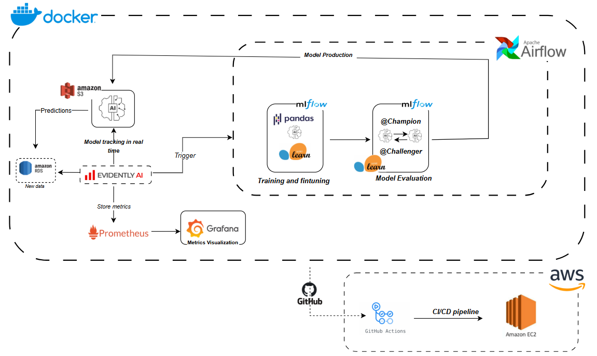
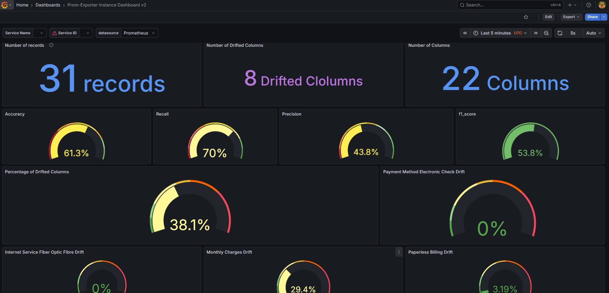

# Telco Churn Prediction MLOps Pipeline 🚀



> **Automated end-to-end MLOps pipeline for predicting customer churn in the telecommunications industry.**

## 📖 Project Overview

This project implements a complete **MLOps (Machine Learning Operations)** pipeline to predict customer churn. It automates the entire lifecycle of the machine learning model, from data ingestion to model monitoring in production.

The goal is to provide a robust, scalable, and reproducible system that:
1. **Retrains automatically** when data drifts or performance drops.
2. **Tracks experiments** and model versions.
3. **Monitors data quality** and model health in real-time.
4. **Deploys seamlessly** using CI/CD.

## 🏗️ Architecture & Tech Stack

The project is built using a modern, containerized stack:

| Component | Technology | Purpose |
|-----------|------------|---------|
| **Orchestration** |  | Schedules and manages the ML pipeline workflows (DAGs). |
| **Experiment Tracking** |  | Tracks metrics, parameters, and artifacts; serves the model registry. |
| **Data Validation** |  | Monitors data drift, target drift, and model performance. |
| **Containerization** |  | Ensures consistent environments across development and production. |
| **Infrastructure** |  | Hosts the application in the cloud. |
| **CI/CD** |  | Automates testing and deployment to EC2. |
| **Monitoring** |   | Collects metrics and visualizes system health dashboards. |
| **Database** |  | Stores metadata for Airflow and MLflow. |

---

## 🚀 Quick Start (Local)

### Prerequisites
- Docker & Docker Compose installed
- Git installed

### 1. Clone the Repository
```bash
git clone https://github.com/BenTouhami-MR/mlops-telco-churn-prediction.git
cd mlops-telco-churn-prediction
```

### 2. Start the Application
```bash
# Start all services
docker-compose up -d --build
```

### 3. Access Services
After a few minutes, access the services:

- **Airflow**: http://localhost:8080 (User: `airflow`, Pass: `airflow`)
- **MLflow**: http://localhost:5000
- **Grafana**: http://localhost:3001 (User: `admin`, Pass: `admin`)
- **Prometheus**: http://localhost:9090

---

## ☁️ Deployment (AWS EC2)

This project uses **GitHub Actions** for continuous deployment.

### 1. Setup Secrets
Add the following secrets to your GitHub repository:
- `AWS_ACCESS_KEY_ID` & `AWS_SECRET_ACCESS_KEY`
- `EC2_HOST` (Public IP)
- `EC2_SSH_KEY` (.pem file content)
- `EC2_USERNAME` (ubuntu)
- `AIRFLOW_UID` (50000)

### 2. Deploy
Push changes to the `dev` branch to trigger automatic deployment:
```bash
git push origin dev
```

For detailed setup instructions, see [DEPLOYMENT.md](DEPLOYMENT.md).

---

## 📂 Project Structure

```text
mlops-telco-churn-prediction/
├── .github/                      # CI/CD pipelines
│   └── workflows/
│       └── deploy.yml            # GitHub Actions workflow for EC2 deployment
│
├── orchestrator/                 # Airflow workflow management
│   ├── dags/                     # Airflow DAG definitions
│   ├── src/                      # ML source code (preprocessing, training)
│   ├── config/                   # Airflow configurations
│   ├── plugins/                  # Custom Airflow plugins
│   ├── Dockerfile                # Custom Airflow image definition
│   ├── init_mlflow.py            # Script to initialize MLflow experiments
│   └── requirements.txt          # Python dependencies for Airflow
│
├── reporting/                    # Monitoring, visualization & drift detection
│   ├── grafana/                  # Grafana dashboards & provisioning
│   ├── prometheus/               # Prometheus metrics configuration
│   ├── airflow_trigger.py        # Script to trigger Airflow DAGs
│   ├── data_loader.py            # Data loading utilities
│   ├── generate_reports.py       # Evidently report generation
│   ├── metrics_exporter.py       # Prometheus metrics exporter
│   ├── model_loader.py           # Model loading utilities
│   ├── preprocess.py             # Data preprocessing logic
│   ├── project.py                # Main monitoring project logic
│   ├── Dockerfile                # Monitoring service Dockerfile
│   └── requirements.txt          # Python dependencies for monitoring
│
├── notebooks/                    # Jupyter notebooks for EDA and prototyping
│   └── (Excluded from git)       # Local experimentation files
│
|Comprehensive EC2 setup script
│
├── docker-compose.yml            # Main container orchestration config
├── requirements.txt              # Top-level dependencies
└── README.md                     # Project documentation
```

---

## 📊 Monitoring Dashboard

The Grafana dashboard provides real-time insights into:
- **Data Drift**: Detects changes in input data distribution.
- **Model Performance**: Tracks accuracy, precision, and recall over time.
- **System Health**: CPU, memory, and container status.



---

## 🤝 Contributing

1. Fork the repository
2. Create your feature branch (`git checkout -b feature/AmazingFeature`)
3. Commit your changes (`git commit -m 'Add some AmazingFeature'`)
4. Push to the branch (`git push origin feature/AmazingFeature`)
5. Open a Pull Request

---

## 📄 License

Distributed under the MIT License. See `LICENSE` for more information.
